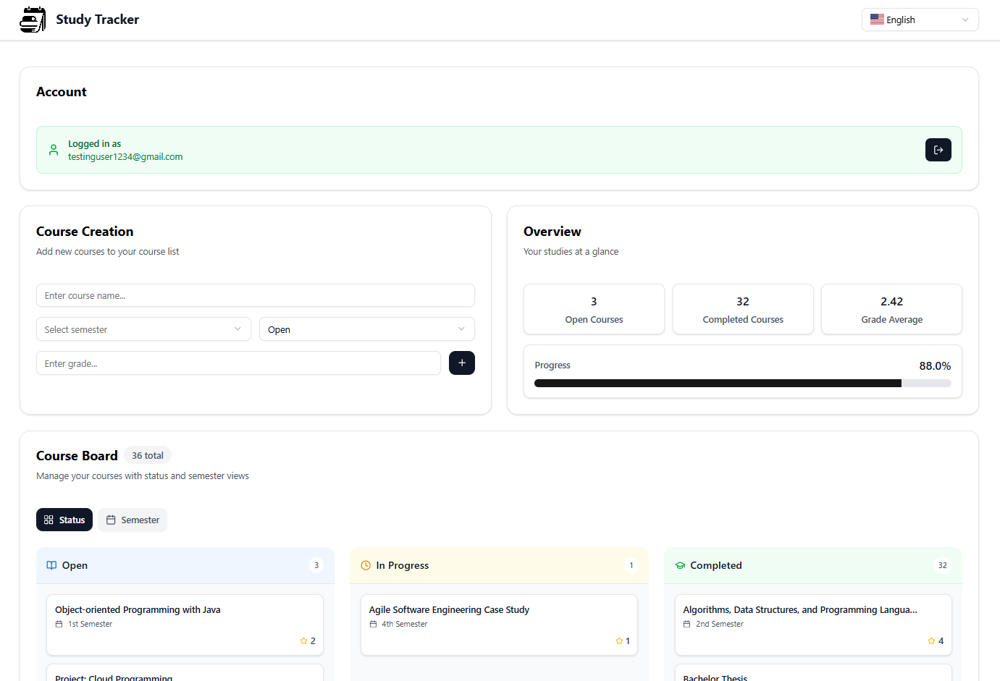
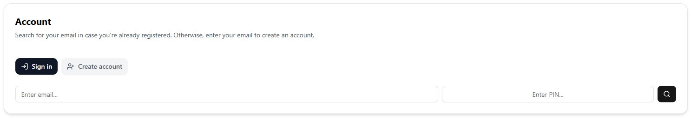
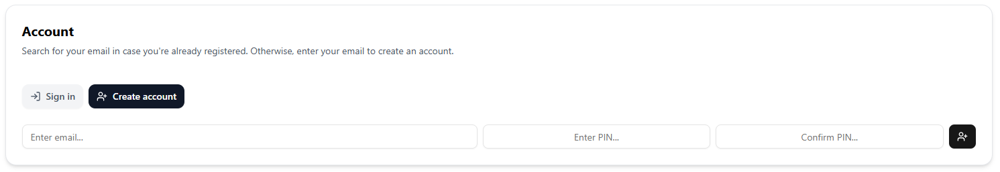
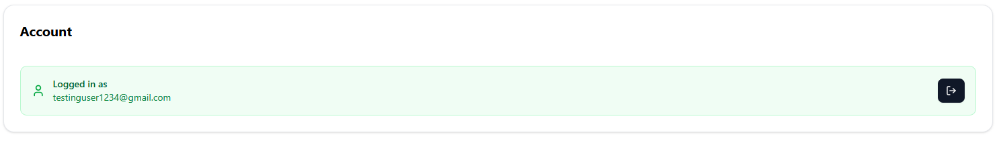
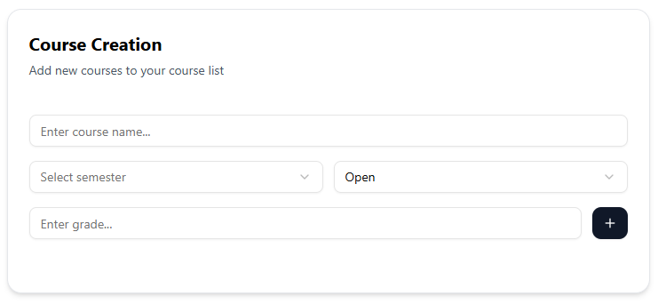
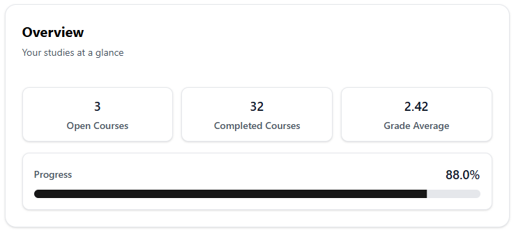
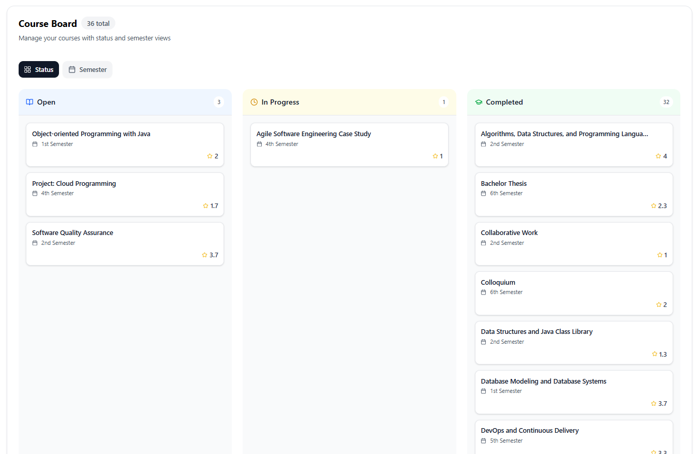
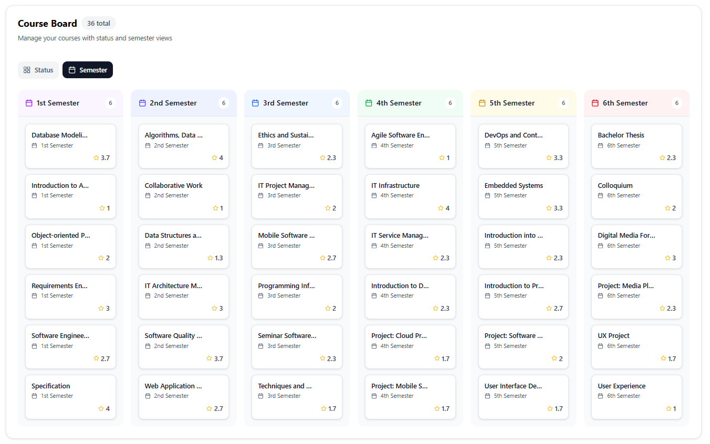

# 📚 Study Tracker

A modern, full-stack web application for tracking academic progress with a clean, maintainable architecture. Built with Next.js, TypeScript, and Prisma, following atomic design principles for maximum scalability and code organization.



## ✨ Features

- **🔐 Secure Authentication**: PIN-based user authentication with sign-in and sign-up flows
- **📊 Course Management**: Add, edit, and delete courses with comprehensive status and grade tracking
- **📈 Progress Analytics**: Visual progress tracking with detailed statistics and grade analysis
- **🌍 Multi-language Support**: Available in English, German, and Spanish
- **📱 Responsive Design**: Seamless experience across desktop, tablet, and mobile devices
- **⚡ Real-time Updates**: Dynamic course status updates with optimistic UI patterns
- **🎨 Modern UI**: Clean, accessible interface built with Tailwind CSS and Radix UI

## 🖼️ Application Screenshots

### Authentication Flow

<div align="center">

| Sign In | Sign Up | Logged In |
|---------|---------|-----------|
|  |  |  |

</div>

### Course Management

<div align="center">

| Course Creation | Overview & Statistics |
|-----------------|----------------------|
|  |  |

</div>

### Course Organization Views

<div align="center">

| Status View | Semester View |
|-------------|---------------|
|  |  |

</div>

## 🏗️ Architecture & Tech Stack

### Frontend
- **Next.js 15** - React framework with App Router
- **React 19** - Latest React with concurrent features
- **TypeScript** - Type-safe development
- **Tailwind CSS** - Utility-first CSS framework
- **R** - Accessible component primitives
- **Lucide React** - Beautiful, customizable icons

### Backend & Database
- **PostgreSQL** - Robust relational database
- **Prisma ORM** - Type-safe database client
- **Next.js API Routes** - Serverless API endpoints

### State Management & Forms
- **TanStack Query** - Server state management
- **Nuqs** - URL state management
- **React Hook Form** - Performant forms with easy validation
- **Zod** - TypeScript-first schema validation

### Development & Quality
- **ESLint** - Code linting with custom rules
- **Prettier** - Code formatting
- **TypeScript** - Static type checking
- **Atomic Design** - Component architecture pattern

## 🎯 Project Structure

This project follows **Atomic Design principles** for maximum maintainability and scalability:

```
src/
├── app/                          # Next.js App Router
│   ├── api/                     # API routes
│   │   ├── courses/            # Course management endpoints
│   │   └── user/               # User authentication endpoints
│   ├── layout.tsx              # Root layout with navigation
│   └── page.tsx                # Main application page
│
├── components/                   # Component library (Atomic Design)
│   ├── atoms/                   # Basic building blocks
│   │   ├── Button.atom.tsx     # Reusable button component
│   │   ├── Text.atom.tsx       # Typography component
│   │   ├── Toast.atom.tsx      # Notification system
│   │   └── EmptyState.atom.tsx # Empty state displays
│   │
│   ├── molecules/               # Composite components
│   │   ├── auth/               # Authentication components
│   │   │   ├── EmailForm.molecule.tsx
│   │   │   ├── ModeSelector.molecule.tsx
│   │   │   └── LoggedInUser.molecule.tsx
│   │   ├── course/             # Course-related components
│   │   │   ├── ViewSelector.molecule.tsx
│   │   │   ├── ViewTab.molecule.tsx
│   │   │   └── CourseTabDropdown.molecule.tsx
│   │   ├── general/            # Shared/reusable components
│   │   │   ├── Card.molecule.tsx
│   │   │   ├── Navbar.molecule.tsx
│   │   │   ├── Select.molecule.tsx
│   │   │   └── LoadingSpinner.molecule.tsx
│   │   └── statistics/         # Analytics components
│   │       ├── OverviewBox.molecule.tsx
│   │       └── ProgressBar.molecule.tsx
│   │
│   ├── organisms/               # Complex, feature-complete components
│   │   ├── auth/               # Authentication flows
│   │   │   ├── Authentication.organism.tsx
│   │   │   └── AccountFinderCard.organism.tsx
│   │   ├── course/             # Course management
│   │   │   ├── CourseList.organism.tsx
│   │   │   ├── CourseTab.organism.tsx
│   │   │   ├── CreateCourse.organism.tsx
│   │   │   ├── StatusView.organism.tsx
│   │   │   ├── SemesterView.organism.tsx
│   │   │   └── CourseColumn.organism.tsx
│   │   └── statistics/         # Analytics & overview
│   │       ├── StudyOverview.organism.tsx
│   │       └── OverviewCard.organism.tsx
│   │
│   └── ui/                     # Shadcn/ui components
│       ├── button.tsx          # Base button primitives
│       ├── input.tsx           # Form input components
│       ├── select.tsx          # Dropdown components
│       └── ...                 # Other UI primitives
│
├── hooks/                       # Custom React hooks
│   ├── useCourses.hook.tsx     # Course data fetching
│   ├── useCourseMutations.hook.tsx # Course CRUD operations
│   └── useTranslation.hook.tsx # Internationalization
│
├── lib/                        # Utility libraries
│   ├── prisma.ts              # Database client
│   ├── react-query.ts         # Query client configuration
│   └── utils.ts               # General utilities
│
├── schemas/                    # Validation schemas
│   ├── dynamicSchemas.ts      # Dynamic form validation
│   └── schema.ts              # Static schemas
│
├── translations/               # Internationalization
│   ├── en.translations.ts     # English translations
│   ├── de.translations.ts     # German translations
│   └── esp.translations.ts    # Spanish translations
│
├── types/                      # TypeScript definitions
│   ├── course.types.ts        # Course-related types
│   ├── email-form.types.ts    # Form types
│   └── general.types.ts       # Shared types
│
└── utils/                      # Utility functions
    ├── validation.utils.ts    # Validation helpers
    └── semester.utils.ts      # Semester formatting
```

## 🚀 Getting Started

### Prerequisites
- Node.js 18+ 
- PostgreSQL database
- npm or yarn

### Installation

1. **Clone the repository**:
   ```bash
   git clone <repository-url>
   cd study-tracker
   ```

2. **Install dependencies**:
   ```bash
   npm install
   ```

3. **Set up environment variables**:
   ```bash
   cp .env.local.example .env.local
   ```
   Configure your database URL and other environment variables.

4. **Set up the database**:
   ```bash
   npm run prisma:migrate
   npm run prisma:generate
   ```

5. **Run the development server**:
   ```bash
   npm run dev
   ```

6. **Open [http://localhost:3000](http://localhost:3000)** in your browser

## 📜 Available Scripts

| Command | Description |
|---------|-------------|
| `npm run dev` | Start development server |
| `npm run build` | Build for production |
| `npm run start` | Start production server |
| `npm run lint` | Run ESLint with custom rules |
| `npm run format` | Format code with Prettier |
| `npm run ts:check` | Type check without emitting |
| `npm run prisma:studio` | Open Prisma Studio |
| `npm run prisma:migrate` | Run database migrations |
| `npm run prisma:generate` | Generate Prisma client |

## 🎨 Design System

### Atomic Design Implementation

This project implements **Atomic Design** methodology for component organization:

- **⚛️ Atoms**: Basic building blocks (buttons, inputs, text)
- **🧬 Molecules**: Groups of atoms functioning together (forms, cards)
- **🦠 Organisms**: Groups of molecules forming distinct sections (headers, course lists)
- **📄 Templates**: Page-level objects placing components into layout
- **📱 Pages**: Specific instances of templates with real content

### Benefits of This Architecture

1. **🔄 Reusability**: Components can be easily reused across different parts of the application
2. **🧪 Testability**: Each component can be tested in isolation
3. **📈 Scalability**: New features can be built by composing existing components
4. **🛠️ Maintainability**: Changes to base components automatically propagate up
5. **👥 Team Collaboration**: Clear component hierarchy makes it easy for teams to work together

## 🌟 Key Features Explained

### Authentication System
- **PIN-based Authentication**: Simple yet secure 6-digit PIN system
- **User Registration**: New users can create accounts with email and PIN
- **Session Management**: Persistent login state using URL parameters

### Course Management
- **CRUD Operations**: Full create, read, update, delete functionality
- **Status Tracking**: Courses can be "Open", "In Progress", or "Done"
- **Grade Management**: Numerical grades (1.0-6.0) with validation
- **Semester Organization**: Courses organized by semester (1-6)

### Data Visualization
- **Progress Statistics**: Visual representation of course completion
- **Grade Analytics**: Average grade calculation and display
- **Multiple Views**: Switch between status-based and semester-based organization

### Internationalization
- **Multi-language Support**: English, German, and Spanish
- **Dynamic Translation**: Runtime language switching
- **Localized Validation**: Error messages in user's preferred language

## 🤝 Contributing

This project follows strict coding standards and architectural patterns. When contributing:

1. Follow the atomic design principles
2. Maintain TypeScript strict mode compliance
3. Use the established folder structure
4. Write comprehensive tests for new components
5. Ensure all linting rules pass

## 📄 License

This project is licensed under the MIT License - see the LICENSE file for details.

---

<div align="center">

**Built with ❤️ using modern web technologies and clean architecture principles**

[Live Demo](https://your-demo-url.com) • [Report Bug](https://github.com/your-username/study-tracker/issues) • [Request Feature](https://github.com/your-username/study-tracker/issues)

</div>
